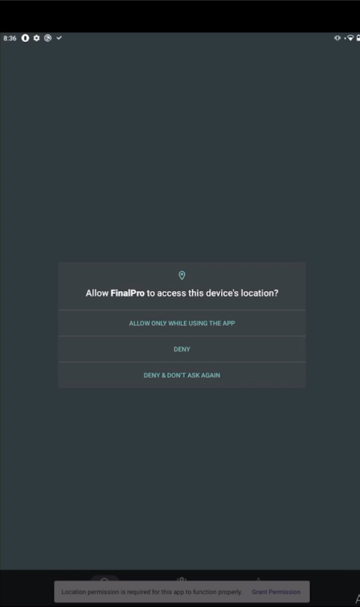

# Overview
The purpose of this application is to allow users to quickly search for places nearby and get information. The reason I made it is to practice working with APIs and Android Studio.

# Details

## APIs
The APIs used were:
- Maps SDK for Android(Maps, markers, etc.)
- Places API (Provides information about specific places)
- Directions API (Gives directions between two places)

All these APIs come from Google. If you want to use my code you will need to get an API key from [google](https://developers.google.com/maps/documentation/javascript/get-api-key). YOu will then need to take this key and put it in the code. 

## Pictures

This shows that the project requests the users permissions. 

The application allows the user to search for places. It has premade searchs like, Fire Station, Hospital, etc. that the user can click on. Once clicked on the user will see the map and can then click on points. Clicking a point provides basic information and allows the users to plot a route to it.

## Known Bugs
Requesting to many locations at one time can lead to issues, but easilty resetable if it happens.
